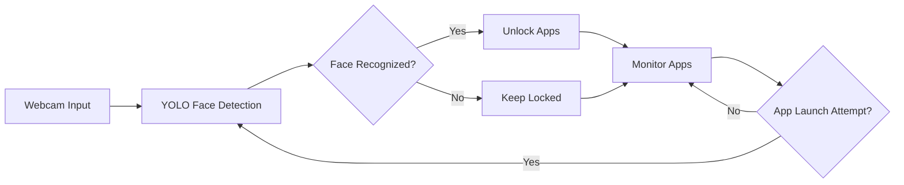
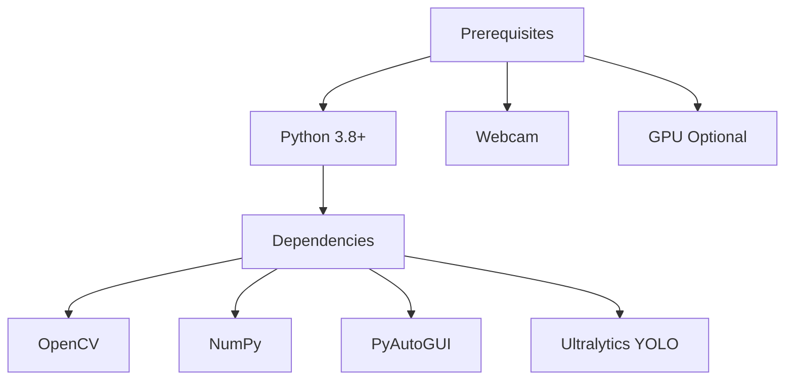
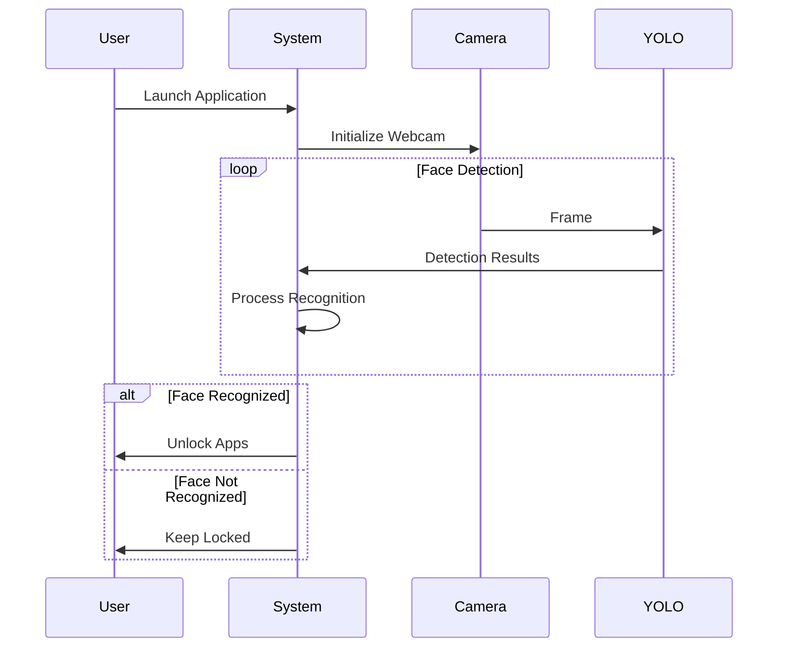

# 🔒 Lock-Unlock Apps Using Face Recognition

<div align="center">


A sophisticated facial recognition system that automatically manages application access through real-time face detection and authentication.

[Features](#features) • [Installation](#installation) • [Usage](#usage) • [Configuration](#configuration) • [Contributing](#contributing)

</div>


## 🌟 Features

| Feature | Description |
|---------|-------------|
| 🎯 Real-time Face Detection | Uses YOLO v8 for accurate and fast face recognition |
| 🔐 App Management | Automatic locking/unlocking based on face detection |
| 📊 Custom Dataset Creation | Tools to create your own facial recognition dataset |
| 🤖 Model Training | Built-in functionality to train custom models |
| 🎨 Dark/Light Theme | Customizable UI appearance |
| 📱 Multi-platform | Works on Windows, Linux, and macOS |

## 🔄 System Architecture



## 🛠️ Installation

### Prerequisites



### Step-by-Step Setup

1. **Clone the repository:**
   ```bash
   git clone https://github.com/amir-rs/Lock-Unlock-Laptop-PC-Screen-Using-Face-Recognition-master.git
   ```

2. **Install dependencies:**
   ```bash
   pip install -r requirements.txt
   ```

3. **Model Setup:**
   ```bash
   # Download YOLO model
   wget https://github.com/ultralytics/assets/releases/download/v0.0.0/yolov8n-face.pt
   ```

## 📋 Configuration Options

| Parameter | Default | Description |
|-----------|---------|-------------|
| `face_confidence` | 0.7 | Minimum confidence threshold for face detection |
| `recognition_interval` | 8s | Time between recognition attempts |
| `max_wrong_attempts` | 3 | Maximum failed recognition attempts |
| `unlock_threshold` | 6 | Required successful recognitions to unlock |

## 🚀 Usage

### Basic Usage

```bash
python app.py
```

### Program Flow



## 🔧 Advanced Configuration

### Model Training Parameters

```yaml
training:
  epochs: 50
  batch_size: 16
  image_size: 640
  learning_rate: 0.01
  momentum: 0.937
  weight_decay: 0.0005
```

## 🤝 Contributing

1. Fork the repository
2. Create your feature branch:
   ```bash
   git checkout -b feature/AmazingFeature
   ```
3. Commit your changes:
   ```bash
   git commit -m 'Add some AmazingFeature'
   ```
4. Push to the branch:
   ```bash
   git push origin feature/AmazingFeature
   ```
5. Open a Pull Request

## 📝 License

This project is licensed under the MIT License - see the [LICENSE](LICENSE) file for details.

## 🔍 Troubleshooting

| Issue | Solution |
|-------|----------|
| Camera not detected | Check USB connection and permissions |
| Model not loading | Verify YOLO model path and file existence |
| High CPU usage | Adjust detection interval in configuration |
| False detections | Increase face_confidence threshold |
